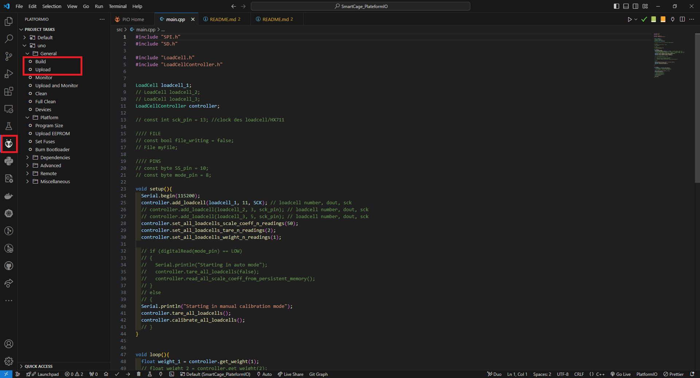

# PlateformIO Arduino Code

This code repository contains the Arduino code for Smart Cage project. It includes the required libraries and header files to make it work. PlateformIO is a VSCode extension that allows Arduino programming and uploading through VSCode instead of Arduino IDE.

## Pros & directory structure

PlateformIO removes the need for a new user to download/save third-party libraries or custom header fiels to specific location to work on the project. It works with standard relative paths, i.e main code will allways be in "/src/main.cpp", libraries will allways be in folders inside "/lib" such as "/lib/HX711" and misc header files (*.c) will be in "/include". Since the folders are automatically add to VSCode's PATH, the IDE won't raise "file not found"/"Missing libraries" errors. WARNING: it's important to respect PlateformIO's directory structure, because the compiler will look for the project dependencies there.

## Dependencies

This project requires the Arduino library "SD". You can install it via Arduino IDE or by downloading and extracting the library archive somewhere in your computer. If manually installed, make sure the library is inside Arduino IDE's library folder or inside the "./lib" folder (in this dir) as it must be in the compiler's PATH directories.

## Changing boards

PlateformIO supports many developpment boards. It can be changed in the plateformio.ini file. However, it's recommended to double check your board's compatibility with PlateformIO first. You will also have to specify the microcontroller architecture. Read the docs here for more info : [PlateformIO Docs](https://docs.platformio.org/en/latest).

## Build & upload

Go to the PlateformIO tab, click Build first, then Upload. To reduce the repository size when sharing, it's recommended to click on "Full Clean" first. It cleans all build/temp files and keeps only the raw codes.

