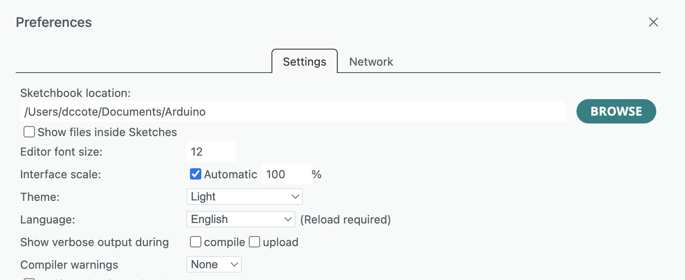

# STUAART

Repo of the STUAART project, created July 12 2023, Nathan Bérubé. Valérie Pineau Noël conitnued the editing. 

[TOC]

## Overview

The STUAART project is an automated weighing system for mice to track mice weights over extended periods of time (weeks). It consists in a few scales (typically 3) in a cage that continuously monitor their load via a "load cell".  This value is proportionnal to the weight when the mouse is immobile.  

Each scale consists in a load cell (Wheatstone bridge) with a HX711 amplifier connected via simple 2-pin protocol (described in datasheet)  to an Arduino compatible microcontroller (Firebeetle in the present design).


## Mechanical components

Mireille has access to all the CAD files of the different mechanical components necessary to create a "scale". Ask her to be added to the Fusion360 team.

There are also two .stl [files](CAD) of the load cell platforms as example for 3D printing. It is important to print with a high infill density to maximize the stifness of the platforms to reduce creep.


## Software components


## Configuring Arduino to program Firebeetle ESP32

The Firebeetle we use is the Firebeetle-ESP32.  There are multiple versions of the FireBeetle board from DFRobot:
-	FireBeetle ESP32 (the one used in this project)
-	FireBeetle ESP8266
-	FireBeetle M0
-	FireBeetle 328P

The Arduino needs to install a "Board Package".

1. Open **Arduino IDE**.

2. Go to **File > Preferences**.

3. In the “Additional Boards Manager URLs”, add:
   https://raw.githubusercontent.com/espressif/arduino-esp32/gh-pages/package_esp32_index.json
   
4. Go to **Tools > Board > Board Manager**.

5. Search for and install **esp32 by Espressif Systems**.

   

## Installing libraries

### How to install the libraries

You can find out where your Libraries are in your preferences:



You need to install 3 components in your Libraries folder:

1. `LoadCellLibrary` and `LoadCellControllerLibrary` (from this source code)

   Copy the repo on your computer and identify the [LoadCellLibrary](Loadcell/ArduinoLibraries/LoadCellLibrary) and the [LoadCellControllerLibrary](Loadcell/ArduinoLibraries/LoadCellControllerLibrary) folders. Copy these folders (i.e. the entire folders) to your Arduino/libraries folder on your computer. 

2. `HX7111` from Bodge at https://github.com/bogde/HX711
   Again., copy the whole repository (src, doc, etc..) into the libraries folder.


You can now use the libraries in your skectch by including them this way.
```c++
#include "LoadCell.h"
#include "LoadCellController.h"	// Will import #include "HX711.h"
```

### Documentation

They are based on the following library that can be found [here](https://github.com/bogde/HX711)

There is a pdf of the documentation in the repo: [Documentation.pdf](Loadcell/ArduinoLibraries/Documentation.pdf)

This pdf was generated from the latex folder with Doxygen: [latex](Loadcell/ArduinoLibraries/latex)

There is also an html file that can be opened on your web browser to have a web page of the documentation
Copy the repo and then open the [index.html](Loadcell/ArduinoLibraries/html/index.html) file.

### Sketch examples

Many useful sketches are saved in this folder. Find it in Loadcell > ArduinoLibraries > SketchExamples. 


## Load cell drift test
Many tests were done to characterize the drift of a load cell. All the Arduino [sketches](Loadcell/LoadcellDriftTest/ArduinoSketch) used for different tests are listed by date in the repo. The small data files are also [here](Loadcell/LoadcellDriftTest/Data).

### What to do when I have these errors? 

#### ```A fatal error occurred: Unable to verify flash chip connection (Serial data stream stopped: Possible serial noise or corruption.).```

The upload speed is too fast. Go in _Tools_ > _Upload Speed_ and change it to a slower speed. 

#### ```SPIFFS Mount Failed```

This happens often when you are using a new Firebeetle ESP-32. Run the script SPIFFS.ino once on the new board. 

## Lab notes:
Lot of tests were done to characterize the drift behavior of a loadcell. Every test is detailled in the following document along with
with the main conclusions about it.

Document: [Lab notes](https://www.overleaf.com/read/vvxvjbdjmgmg)


## Capacitive sensor:
An Arduino sketch [example](CapacitiveSensor/CapacitiveSensorSketchExample/CapacitiveSensorSketchExample.ino) is available to get started

A short [guide](CapacitiveSensor/GuideCapacitiveSensorWithArduino.pdf) is also available to understand everything about capacitive sensors. It also contains all to links to the Arduino library for installation and the documentation.

## Code for a quick start with one loadcell
```
#include "LoadCell.h"
#include "LoadCellController.h"
#include <SPI.h>

LoadCell loadcell; // name the loadcell
LoadCellController loadcell_controller; // create the loadcell controller, one per cage with many loadcells 

void setup() {
  // 1. Set the serial communication.
  // 2. Add the loadcells individually.
  // 3. Easy start 
  // possibility to saves variables on the EEPROM. The loadcell #1 always has the slot #1 on the EEPROM. 

Serial.begin(9600);
  loadcell_controller.add_loadcell(loadcell); // add individual loadcells. One add_loadcell and easy_start per loadcell
  soleil_controller.easy_start_with_params(
                                    1,         // loadcell_number
                                    8,         // dout pin
                                    9,         // sck pin
                                    true,      // calibrate offset
                                    true,      // calibrate scale
                                    false,     // read offset to memory
                                    false,     // read scale to memory
                                    true,      // save offset to memory
                                    true,      // save scale to memory
                                    0,         // tare offset manually, no specification if 0
                                    0,         // scale coeff manually, no specification if 0
                                    128        // gain, don't change! 
                                    );                                   
}

void loop() {
  loadcell_controller.wait_ready_timeout(1, 1000); // reads if something is measured by the loadcell. If not, takes a measure every 1 second (1000 ms). 1 = loadcell number
  float reading = loadcell_controller.get_weight(1); // 1 = loadcell number
  Serial.println(reading);
}
```

## How to generate documentation with Doxygen

First of all, you need to download Doxygen and LaTex on your computer.

After that, you need to open a terminal where your code is stored to generate a Doxyfile. Run the following command
```console
doxygen -g
```
Next, you can open the generated Doxyfile in your folder to change the RECURSIVE parameter. Set it to YES. This way dpxygen will search are code files that are inside the current repository to generate your documentation.
Alternatively, you can also specify sub-folders path at the INPUT parameter in the Doxyfile.

Now, with the Doxyfile, you can generate html and latex folders with the following command
```console
doxygen Doxyfile
```
You will see the html and latex folders appear in the folder where the Doxyfile is. If you open the index.html file in the html folder, you'll be accessible to see the documentation on your web browser.
You can also generate a pdf of the documentation using the latex folder. Open a new terminal in this folder and run the following command
```console
pdflatex refman.tex
```
This will generate a file named refman.pdf in the latex folder, it is the documentation. You can rename and move this file.
